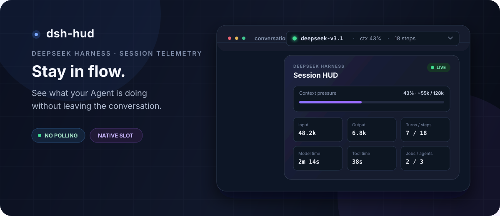
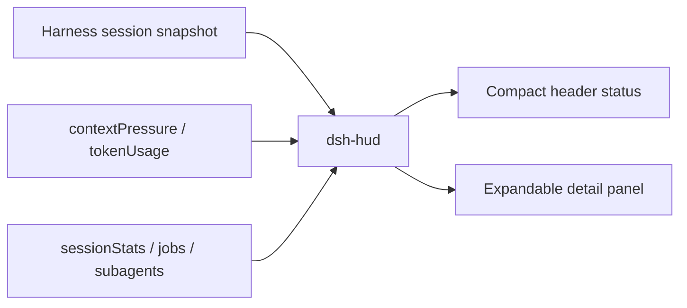

<div align="center">



# ◉ dsh-hud

<sub><code>DeepSeek Harness · Session HUD</code></sub>

**把模型、上下文、Token 和执行状态，收进会话标题栏的一小块 HUD。**

无需轮询 · 不侵入核心 UI · 不占用模型上下文 · 点击即看完整会话遥测

[](LICENSE)
[](#-兼容性)
[](tsconfig.json)
[](#-开发与测试)
[](#-工作原理)

<sub>🎬 更多 AI 工具实战玩法：作者抖音 <strong>@泽轩604</strong></sub>

<sub><a href="#-这是什么">这是什么</a> · <a href="#-功能">功能</a> · <a href="#-安装">安装</a> · <a href="#-工作原理">原理</a> · <a href="#-常见问题">FAQ</a> · <a href="#-english">English</a></sub>

</div>

---

## 🔭 这是什么

`dsh-hud` 是一个面向 [DeepSeek Harness](https://github.com/deepseek-ai/DeepSeek-Harness) Web UI 的实时会话状态插件。

它把最常用的运行信息放进会话标题栏：当前模型、Agent 状态、上下文占用率和累计步数。点击紧凑状态条，会展开 Token、耗时、后台任务、子 Agent、Provider 与工作区等完整信息。

目标很简单：**不用离开当前会话，就知道 Agent 在做什么、做了多久、还剩多少上下文。**

## ✨ 功能

| | 能力 |
|---|---|
| 🟢 | **运行状态**：Agent 运行时显示动态状态点，空闲时自动归静 |
| 🤖 | **模型路由**：展示最近一次 Assistant 调用使用的模型与 Provider |
| 🧠 | **上下文压力**：显示占用百分比、已用 Token 与上下文窗口，并用进度条直观呈现 |
| 🔢 | **Token 统计**：汇总未缓存输入、缓存读写与输出 Token |
| 🧭 | **会话进度**：实时显示 Turns、Steps、模型耗时和工具耗时 |
| 🧵 | **并行任务**：展示正在运行的 Jobs 与当前子 Agent 数量 |
| 📍 | **会话定位**：快速查看 Workspace 与 Session ID |
| 🎨 | **原生观感**：复用 Harness 主题变量，支持明暗主题、窄屏与减少动态效果偏好 |
| ♿ | **键盘可用**：支持焦点状态、`Esc` 关闭详情面板与完整 ARIA 描述 |
| 🪶 | **轻量无轮询**：直接消费 Harness snapshot 与 projection，不额外请求 Host |

## 🚀 安装

### 环境要求

- DeepSeek Harness `0.1.0-rc.6`
- Node.js `22.19+` 或 `24+`
- pnpm `11.x`

### 一行安装（推荐）

```bash
npx --yes @deepseek-ai/dsh@0.1.0-rc.6 plugin --profile web add github:zexuanw958-svg/dsh-hud
```

### 从源码安装

```bash
git clone https://github.com/zexuanw958-svg/dsh-hud.git
cd dsh-hud
pnpm install
pnpm build

# 安装到 DeepSeek Harness 的 Web profile
npx --yes @deepseek-ai/dsh@0.1.0-rc.6 plugin --profile web add "$(pwd)"
```

然后重启 Web UI：

```bash
npx --yes @deepseek-ai/dsh@0.1.0-rc.6 web
```

打开任意会话后，HUD 会出现在会话标题栏。点击它即可展开详情。

> 插件通过本地 `link:` 安装。移动或删除仓库目录会让链接失效；需要卸载时运行 `npx --yes @deepseek-ai/dsh@0.1.0-rc.6 plugin --profile web remove dsh-hud`。

## 🏗️ 工作原理



插件使用官方 `conversation.session.header.actions` slot 注入一个自包含的 React 组件：

- Host 侧只负责注册插件，不拦截或改写 Agent 流程；
- Client 侧订阅 Harness 已有的 session snapshot 与 projections；
- 数据变化由 Harness 推送触发渲染，没有定时轮询；
- HUD 数据只用于 UI，不会被塞进提示词或占用模型上下文。

## 📁 项目结构

```text
dsh-hud/
├── src/
│   ├── index.ts             # Host 插件入口
│   └── client/
│       ├── index.tsx        # Header slot 与 HUD 组件
│       ├── format.ts        # Token、耗时与模型路由格式化
│       └── styles.ts        # Harness 主题适配样式
├── tests/                   # 单元测试与构建产物契约测试
├── cordis.patch.yml         # DSH bundle patch
├── tsdown.config.ts         # Host / Client 双入口构建
└── package.json
```

## 🧪 开发与测试

```bash
pnpm install
pnpm check
```

`pnpm check` 会依次执行严格类型检查、Host/Client 构建和 Vitest 测试。

## 🧩 兼容性

| dsh-hud | DeepSeek Harness | 状态 |
|---|---|---|
| `0.1.x` | `0.1.0-rc.6` | ✅ 已验证 |

DeepSeek Harness 目前仍处于 RC 阶段，官方 slot 或 projection API 变化时，本插件也可能需要跟随升级。

## ❓ 常见问题

**为什么打开首页看不到 HUD？**

HUD 属于会话标题栏。先打开或创建一个会话，它才会出现。

**会拖慢 Agent 或额外消耗 Token 吗？**

不会。插件只消费 Harness 已经维护的前端状态，没有额外模型调用，也不会把统计信息写入模型上下文。

**为什么上下文或模型一开始显示为空？**

新会话尚未发生模型调用时，还没有可统计的数据。发送第一条消息后会自动更新。

**支持桌面端或其他 profile 吗？**

当前版本针对 Web profile 构建和验证；其他平台尚未承诺兼容性。

## 🗺️ Roadmap

- 可配置的 HUD segments 与显示顺序
- Git branch / dirty state / CI 状态数据源
- 上下文压力阈值与视觉告警
- 主题包与第三方 segment provider 协议

## 📄 许可证

[MIT](LICENSE) —— 可自由使用、修改和分发。欢迎 Issue 与 PR。

---

## 🌐 English

`dsh-hud` is a compact, live session telemetry plugin for the [DeepSeek Harness](https://github.com/deepseek-ai/DeepSeek-Harness) Web UI.

It adds a native-looking status strip to the official session header slot. The compact view shows the active model, Agent state, context pressure, and step count; click it for token usage, timing, jobs, subagents, provider, workspace, and session details.

### Highlights

- Native `conversation.session.header.actions` integration
- Live context pressure and token accounting
- Turns, steps, model time, and tool time
- Active jobs and subagent count
- Harness theme tokens, responsive layout, and accessible keyboard behavior
- No polling, no extra Host requests, and zero model-context overhead

### Install

```bash
npx --yes @deepseek-ai/dsh@0.1.0-rc.6 plugin --profile web add github:zexuanw958-svg/dsh-hud
npx --yes @deepseek-ai/dsh@0.1.0-rc.6 web
```

Or install from a local checkout for development:

```bash
git clone https://github.com/zexuanw958-svg/dsh-hud.git
cd dsh-hud
pnpm install
pnpm build
npx --yes @deepseek-ai/dsh@0.1.0-rc.6 plugin --profile web add "$(pwd)"
npx --yes @deepseek-ai/dsh@0.1.0-rc.6 web
```

Open a session and look for the HUD in its header. Run `pnpm check` to type-check, build, and test the project.

### License

[MIT](LICENSE). Issues and pull requests are welcome.
